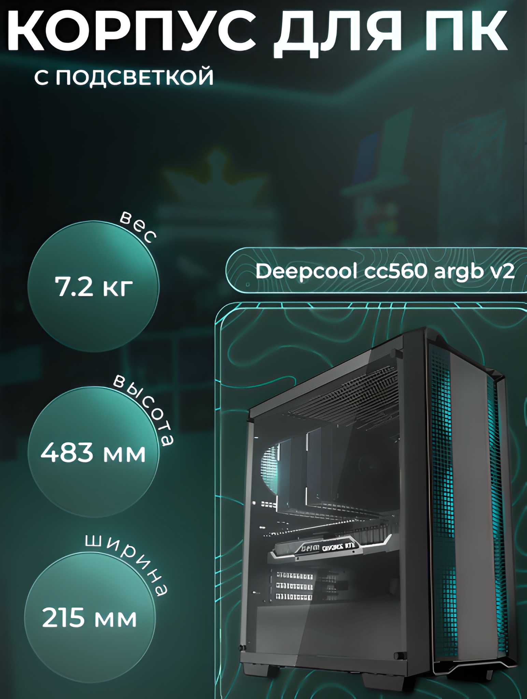
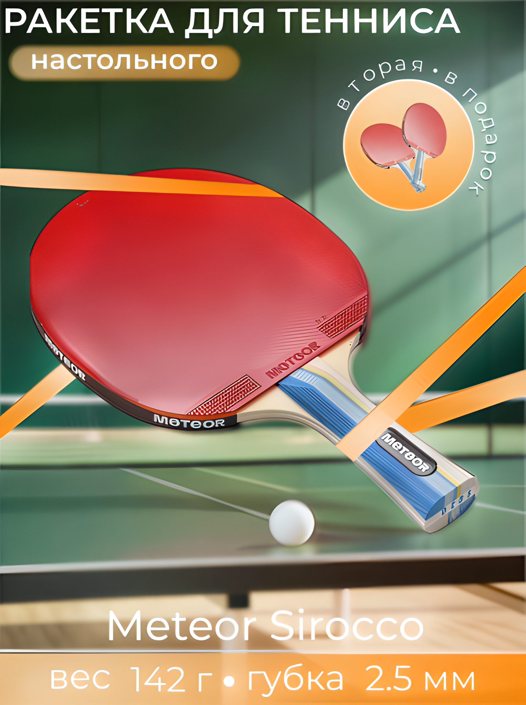
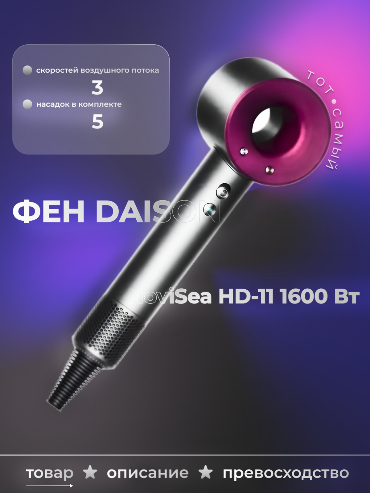
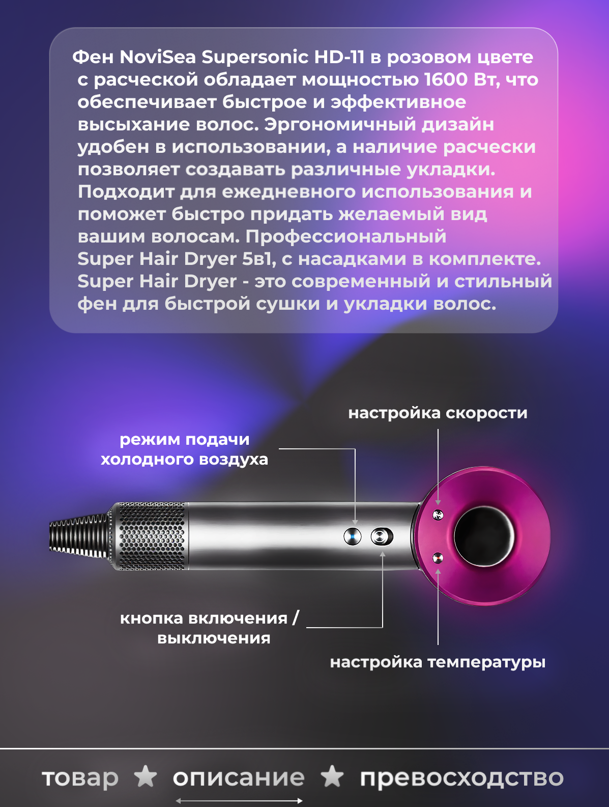
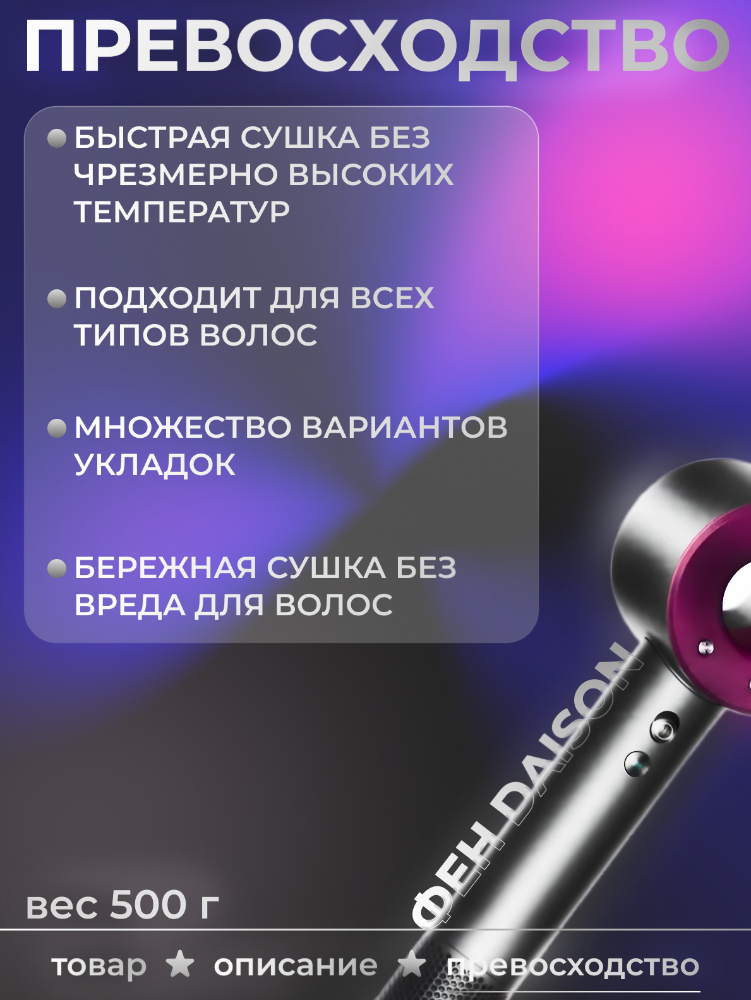

# 🎴 My-infographics-for-marketplaces

  <a href="#english">English</a> •
  <a href="#chinese">中文</a> •
  <a href="#russian">Русский</a>

---

## 🇬🇧 E-Commerce Infographics Portfolio
Professional showcase of high-converting infographic designs optimized for major digital marketplaces.

### 📦 Commercial Design Cases

  
  
  

### 🌪 Premium Hairdryer (Dyson Concept)

  
  
  

### 🔊 Acoustics & Smart Systems (Speaker Concept)

  
  
  

### 🛠 Tools
- **Design:** Figma
  
### 🔒 Copyright
© 2025–2026 **Akbarov Damir**. All rights reserved.

This project and all its visual assets (including infographics, charts, and graphic design concepts) were developed using **Figma** and are strictly for portfolio and academic demonstration purposes. Unauthorized downloading, replication, distribution, modification, or commercial exploitation of these materials without the author's express, prior written permission is strictly prohibited.

---

## 🇨🇳 电商视觉设计与主图视觉作品集
展示针对主流电商平台优化的高转化率主图及详情页视觉设计。

### 📦 商业设计案例展示
  

### 🌪 高端吹风机视觉概念设计 (Dyson 概念)
  

### 🔊 智能声学与音箱视觉概念设计 (智能音箱概念)
  

### 🛠 工具
- **设计软件:** Figma

### 🔒 版权声明
© 2025–2026 **Akbarov Damir**. 版权所有。

本仓库及其所有视觉资产（包括电商主图、详情页设计及视觉概念）均基于 **Figma** 开发，仅用于个人作品集展示与学术交流。未经作者明确书面许可，严禁对这些材料进行任何形式的未经授权的下载、复制、分发、篡改或商业化利用。

---

## 🇷🇺 Портфолио коммерческой инфографики для маркетплейсов
Профессиональная демонстрация высококонверсионного графического дизайна, оптимизированного под требования ведущих торговых платформ.

### 📦 Кейсы коммерческого дизайна
  

### 🌪 Премиальная бытовая техника (Концепт Dyson)
  

### 🔊 Смарт-акустика и цифровые системы (Концепт умной колонки)
  

### 🛠 Инструменты
- **Дизайн:** Figma

### 🔒 Авторские права
© 2025–2026 **Akbarov Damir**. Все права защищены.

Данный проект и все входящие в него визуальные активы (включая инфографику, карточки товаров и концепты графического дизайна) разработаны в среде **Figma** и предназначены исключительно для демонстрации в рамках портфолио. Любое несанкционированное копирование, тиражирование, распространение, изменение или коммерческое использование данных материалов без предварительного письменного согласия автора строго запрещено.
